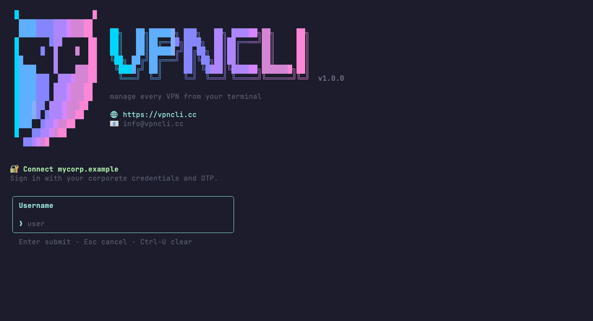

<h1 align="center">vpncli</h1>

<p align="center">
  <strong>Manage every VPN from your terminal.</strong><br>
  One dashboard for your xray proxy <em>and</em> every full-tunnel VPN on the
  machine — WireGuard, Outline, OpenVPN, v2RayTun, Happ, Check Point… Auto-detected,
  grouped into cards, each with a live flag, ping and traffic, connect/disconnect with a keypress.
</p>

<p align="center">
  <a href="https://github.com/vpncli/vpn/actions/workflows/release.yml"></a>
  <a href="https://github.com/vpncli/vpn/releases/latest"></a>
  <a href="https://github.com/vpncli/vpn/releases"></a>
  
  <a href="LICENSE"></a>
</p>

<p align="center">
  <a href="https://vpncli.cc"><strong>vpncli.cc</strong></a> ·
  <a href="#install">Install</a> ·
  <a href="mailto:info@vpncli.cc">info@vpncli.cc</a> ·
  <a href="CHANGELOG.md">Changelog</a>
</p>

<p align="center">
  
</p>

---

## The trick: a full-tunnel VPN **and** xray, at the same time

Most VPNs are **full tunnels** (WireGuard, Outline, OpenVPN, Check Point…). They rewrite the OS
routing table and grab the *single* default route, so **all** traffic goes through them — and only
**one** can be active at a time (they fight over that one default route).

**xray is different.** It's a local SOCKS/HTTP **proxy**: apps opt in (system proxy + env), and xray
routes each connection **by rules** — this domain direct, that one through your server, ads blocked.
It never touches the routing table, so it **coexists** with anything.

So you can keep your **work VPN** up (say corporate Check Point or WireGuard, tunnelling everything to
the office) **and** run a flexibly-routed **xray** on top — AI through your own server, Russian sites
direct, the rest following the corporate tunnel. `vpncli` manages both from one screen:

- full tunnels are **mutually exclusive** — connect one and it drops the others for you;
- **xray always layers on top** — it's a proxy, it coexists;
- every service is a card, tagged **`🌐 ALL TRAFFIC` (tunnel)** or **`⚡ BY RULES` (proxy)** so you
  always know what grabs what.

## Features

- 🧩 **Every VPN, one dashboard** — xray servers + full-tunnel app-VPNs, auto-detected and grouped by type
- 🌐 **Tunnel vs proxy, clearly marked** — full tunnels capture all traffic; xray routes by rules and coexists
- 🔌 **Connect / disconnect anything** — each service is a card; a master **Disconnect all** up top
- 📡 **Subscriptions without the vendor app** — paste any subscription link (even a Happ / v2RayTun deep-link); vpncli fetches the whole server list. No closed-source client to install — it's **MIT-licensed**, so you can read and build every line that runs
- 📊 **Live everything** — country flag, ping, and live up/down traffic per service
- 🧭 **xray routing without the syntax** — a guided wizard + toggleable presets (direct / proxy / block)
- ⌨️ **Keyboard-native** — arrows **or WASD** (incl. ЙЦУКЕН ц/ф/ы/в), **Tab** to dive in, **Enter** to act
- 🌍 **Bilingual** — English / Русский, switched live
- 📦 **Self-contained binary** — no Node, no jq; only the xray *proxy* needs the `xray` binary
- 🖥 **macOS & Linux** — app-VPN detection via `scutil` / Check Point `trac` (macOS) and NetworkManager (Linux)

## Install

**macOS (Homebrew)**
```sh
brew install vpncli/tap/vpn       # pulls in xray automatically
```

**Ubuntu 22.04+ (apt)**
```sh
curl -fsSL https://vpncli.github.io/vpn/key.gpg | sudo gpg --dearmor -o /etc/apt/keyrings/vpn.gpg
echo "deb [signed-by=/etc/apt/keyrings/vpn.gpg] https://vpncli.github.io/vpn stable main" \
  | sudo tee /etc/apt/sources.list.d/vpn.list
sudo apt-get update && sudo apt-get install vpn
# xray is only needed for the xray proxy — install it once if you want one:
bash -c "$(curl -fsSL https://github.com/XTLS/Xray-install/raw/main/install-release.sh)"
```

**Any platform (curl)**
```sh
curl -fsSL https://raw.githubusercontent.com/vpncli/vpn/main/install.sh | bash
```

## Quick start

```sh
vpn                               # open the dashboard — manage everything from here
vpn add vless://...your-link...   # add & activate an xray server (or do it in the app)
vpn on                            # turn the xray proxy on
vpn off                           # turn it off
```

First run, nothing configured yet? Just `vpn` — the big button is **+ Add xray server**; paste your
`vless://` link and you're connected, without ever leaving the TUI:

<p align="center">
  
</p>

## The app

Run `vpn` with no arguments. Every detected VPN service is a card, grouped by type. The **power
button** up top adapts to your state:

| state | button | Enter |
|---|---|---|
| something connected | **⏻ Disconnect all** | drops every tunnel + xray |
| all off, xray configured | **⏻ Enable `<server>`** | turns the xray proxy on |
| all off, nothing configured | **+ Add xray server** | opens the add-server form |

### Navigating

- **↑ ↓ ← →** or **WASD** (and the same physical keys on the Russian ЙЦУКЕН layout — `ц/ф/ы/в`)
  move between cards
- **Enter** performs the card's action — connect / disconnect / switch
- **Tab** dives *in*: the xray card opens its full panel; a multi-profile app expands its members;
  **Settings** opens with Tab too
- **Backspace** removes (e.g. a routing rule — so Enter never deletes by accident)
- **q / Esc** go back / quit

### Detected services

| Source | Detected | Control |
|---|---|---|
| **xray** (ours) | every server profile | turn on/off, switch server, per-rule routing, live traffic |
| **macOS app-VPNs** (`scutil`) | WireGuard, Outline, v2RayTun, Happ… | connect / disconnect (falls back to opening the app) |
| **Check Point** (`trac`) | the corporate Endpoint Security tunnel | connect with **password + OTP** in-app, or disconnect |
| **Linux** (NetworkManager) | WireGuard, OpenVPN/OpenConnect… connections | `nmcli` up / down |

Each up service shows its country flag (geo of the exit IP), latency, and live ↑/↓ traffic.

### Check Point (corporate VPN)

Corporate **Check Point Endpoint Security** normally means a clunky GUI plus a separate OTP app.
`vpncli` detects the `trac` client and connects it **without leaving the terminal** — Enter on the
Check Point card (or `vpn connect "Check Point"` from the shell) walks you through
**username → password → one-time code**, then brings the tunnel up. It's a full tunnel, so connecting
it drops the other tunnels — but your xray proxy keeps running on top, so per-rule routing still
applies over the corporate link.

<p align="center">
  
</p>

### The xray panel

**Tab** into the xray card for a focused panel: your real vs VPN IP up top, every server as a card
(Enter switches, Tab edits/renames/removes), and a **Routing** widget. Each **subscription** shows as
its own block (📡 name · N servers) — **Tab** into it to pick a server. The panel re-fetches your
subscriptions on open (and on launch), like a VPN client keeping its list current — without touching
the running connection; switching servers is the only thing that restarts xray.

<p align="center">
  
</p>

### Routing (xray)

Decide what skips the proxy, what's forced through it, and what's blocked — without learning xray
syntax. The **Add rule** wizard walks you through it: a website, a known service (OpenAI, Netflix,
Telegram…), a whole country, or an IP/subnet. Each rule lands in one of three buckets:

- **direct** — bypass the proxy (local sites, corporate hosts, your work tunnel's traffic)
- **proxy** — force through the xray server (a service blocked in your region)
- **block** — drop it (ads / trackers)

Precedence is **block → proxy → direct**, then private/localhost always go direct, and anything
unmatched goes through the proxy. Prefer ready-made bundles? Toggle **presets** (`ru-direct`,
`ai-via-vpn`, `streaming-via-vpn`, `ads-block`, `dev-direct`).

<p align="center">
  
</p>

### Languages

Switch the whole interface between **English** and **Русский** on the fly (Settings → Language).

<p align="center">
  
</p>

## Commands

Everything in the app is also a plain command — including connecting the app-VPNs and Check Point.

| | |
|---|---|
| `vpn` | interactive dashboard |
| `vpn on` · `off` · `restart` | xray proxy: connect / disconnect / reconnect |
| `vpn services` | list every detected VPN (● = connected) |
| `vpn connect <name>` | connect an app-VPN / Check Point by name |
| `vpn disconnect <name>\|all` | disconnect one service, or everything |
| `vpn status` · `ip` · `log [N]` | live status · IPs · last log lines |
| `vpn add <vless://…> [name]` | add a server |
| `vpn add <subscription-url>` | add every server from a subscription / app deep-link |
| `vpn sub ls` · `sub update [name]` · `sub rename <old> <new>` · `sub rm <name>` | manage subscriptions |
| `vpn ls` · `use [name]` · `show [name]` · `rm [name]` | manage servers |
| `vpn route ls` · `route add\|rm direct\|proxy\|block <rule>` · `route edit` | edit routing |
| `vpn preset ls` · `preset on\|off [name…]` | toggle presets |
| `vpn lang en\|ru` | set language |
| `vpn init` | auto-source the proxy env in new terminals |

`vpn connect "Check Point"` prompts for your password + OTP (input fields, no flags to type). For
scripts, pass `--user`/`--password`/`--otp` (or set `VPN_PASSWORD`) to skip the prompt. Connecting a
full tunnel disconnects the other tunnels but leaves your xray proxy running.

**Subscriptions — without the app.** Providers usually hand you a subscription link and tell you to
install *their* app (Happ, v2RayTun…) to use it. You don't have to. Paste that same link — even when
it's wrapped in an app deep-link or redirect, e.g.
`https://…/redirect?url=happ://add/https://provider.tld/sub/TOKEN` — into `vpn add` (or `vpn sub add`)
and vpncli does exactly what the app would: unwraps it, fetches the list, and adds every server,
grouped under one subscription. It reads both the **base64 `vless://`** format and the
**xray / sing-box JSON** format those panels serve, and sends the stable per-machine **device id**
(`x-hwid`) that HWID-gated panels (Remnawave) expect, so you get the real list (if the panel limits
devices, free a slot in the provider's app/bot first).

The difference: vpncli is **open source (MIT)**. Instead of trusting an opaque binary to decide what
runs on your machine and where your traffic goes, you drive your subscription from one small CLI whose
every line is on GitHub — read it, build it yourself, pin the version.

```sh
vpn add "happ://add/https://provider.tld/sub/TOKEN"   # or the bare https:// URL
vpn sub ls                  # list subscriptions
vpn sub update [name]       # re-fetch (refresh the server list)
vpn sub rename <old> <new>  # rename a subscription
vpn sub rm <name>           # remove the subscription and all its servers
```

In the app, each subscription is a block in the **xray panel** — Tab into it to pick a server, or
**Rename** / **Delete** the whole subscription right there. The list re-fetches on launch and on
opening the panel, without restarting your connection.

<p align="center">
  
</p>

## Configuration

State lives under `~/.config/vpn/` (xray side only — app-VPNs keep their own config):

```
servers/<name>.json   parsed server profiles
routes/{direct,proxy,block}.list   your routing lists
presets.enabled       enabled presets
active                active server name
lang                  ui language (en|ru)
dns.json              OPTIONAL — override the DNS block (e.g. split-DNS to an internal resolver)
config.json           GENERATED xray config (don't edit by hand)
```

Need internal/corporate routing? Keep it out of any shared config: add hosts with
`vpn route add direct <rule>`, set extra proxy-bypass hosts via `VPN_EXTRA_BYPASS`, and point
internal domains at an internal resolver with a `dns.json`.

## Updating

Use the same channel you installed from:

```sh
brew upgrade vpn                                   # Homebrew
sudo apt-get update && sudo apt-get install --only-upgrade vpn   # apt
curl -fsSL https://raw.githubusercontent.com/vpncli/vpn/main/install.sh | bash   # curl (re-run = upgrade)
```

`vpn` only ever stores plain config under `~/.config/vpn/`, so upgrades never touch your servers or
routing. Check your version with `vpn --version`.

When a newer release is out, `vpn` shows a one-line yellow notice with the upgrade command. The check
runs in the background (at most once a day) and never slows a command down. Set `NO_UPDATE_NOTIFIER=1`
to turn it off.

## Uninstalling

First, undo what `vpn` changed at runtime — this clears the system proxy + env vars and stops xray:

```sh
vpn off
```

Then remove the binary (whichever channel you used):

```sh
brew uninstall vpn                 # Homebrew
sudo apt-get remove vpn            # apt
sudo rm "$(command -v vpn)"        # curl install (usually /usr/local/bin/vpn)
```

Finally, drop the leftovers if you want a clean slate:

```sh
rm -rf ~/.config/vpn               # servers, routes, presets, generated config
```

`vpn` also adds a two-line auto-source block to your shell rc (`~/.zshrc` or `~/.bashrc`); delete it
to finish up:

```
# vpn proxy env
[ -f ~/.config/vpn/proxy.env ] && source ~/.config/vpn/proxy.env
```

App-VPNs (WireGuard, Outline, Check Point…) keep their own clients and config — `vpn` only detects
them, so uninstalling it leaves them untouched.

---

## Contributing

The app is TypeScript + [Ink](https://github.com/vadimdemedes/ink), bundled to a single binary by
[Bun](https://bun.sh).

### Setup

```sh
git clone git@github.com:vpncli/vpn.git && cd vpn
curl -fsSL https://bun.sh/install | bash   # if you don't have Bun
bun install

bun run dev -- status        # run from source
bun run typecheck            # tsc --noEmit
bun run build                # cross-compile dist/vpn-<os>-<arch> for all platforms
```

### Project layout

```
src/
  cli.tsx           argv parsing (meow) → command or the Ink app
  core/
    services.ts     unified VPN-service model: xray + macOS scutil app-VPNs + Check Point + Linux NM
    tunnels.ts      low-level probes: interfaces, traffic, Check Point trac
    config.ts       xray config generation (pure, validated with `xray -test`)
    servers/routes/presets/xray/ping/geo/i18n  …rest of the pure logic (no UI imports)
  os/               platform proxy backends: darwin (networksetup+launchctl), linux (gsettings)
  ui/
    InteractiveApp  dashboard, screen routing, the power button + actions
    grid.ts         shared card-grid geometry + `useCardNav` (arrows/WASD/ЙЦУКЕН)
    Widget/Button/CardGrid/CardSelect/Hint   shared card primitives
    ServiceRow/RoutingCards/XrayPanel/TextInput   service cards, routing editor, xray panel, inputs
  i18n/ru.ts        Russian translations (keyed by the English source string)
scripts/            build (cross-compile), build-deb, publish-apt
Formula/vpn.rb      Homebrew formula
debian/, packaging/ Debian package files
docs/               GitHub Pages = APT repo; images/ + tapes/ for the README GIFs
```

Adding a user-facing string? Wrap it with `t("English text")` and add the Russian to
`src/i18n/ru.ts`. New VPN-service support goes in `src/core/services.ts` as another provider behind a
platform guard. The config generator (`src/core/config.ts`) is pure and validated with `xray -test`
before anything is applied.

### README GIFs

The demos are scripted with [vhs](https://github.com/charmbracelet/vhs) (tapes in `docs/tapes/`).
They run with **`VPN_DEMO=1`** (canned services, IPs, geo, ping, and traffic — see
`src/core/demo.ts`) against a throwaway config seeded with fake servers, so a recording never
touches the network or shows a real VPN:

```sh
brew install vhs
bun run build                                   # the tapes record the installed `vpn`
XDG_CONFIG_HOME=/tmp/vpndemo bun scripts/demo-seed.ts   # fake servers/routes/presets
for t in quickstart commands overview servers check-point routing language; do vhs docs/tapes/$t.tape; done
```

Each tape already exports `VPN_DEMO=1 XDG_CONFIG_HOME=/tmp/vpndemo`, so you only seed once.

### Releasing

Releases are **automatic** — no manual versioning. Push source changes to `main` and
`.github/workflows/release.yml` bumps the **patch** version in `package.json`, builds the binaries
+ `.deb`s with that version, creates the GitHub Release + tag, publishes the signed APT repo to
Pages, and patches the Homebrew formula. The bump is committed back to `main` with `[skip ci]`, so it
never loops; docs/README/GIF-only changes don't cut a release.

Need a minor or major bump? Run the workflow by hand from the **Actions** tab (`workflow_dispatch` →
`patch` / `minor` / `major`).

Required repo secrets:
- **`HOMEBREW_TAP_TOKEN`** — a PAT with write access to `vpncli/homebrew-tap`, so CI can push the
  updated formula there. **Without it `brew upgrade` stays on the old version** (CI only uploads the
  patched formula as a run artifact for you to commit by hand).
- **`GPG_PRIVATE_KEY` / `GPG_KEY`** — to sign and publish the APT repo to Pages.

Other notes:
- `github-actions[bot]` must be allowed to push to `main` (no blocking branch protection) so the
  version bump persists.
- GIFs are **not** regenerated by CI — re-record them locally when the UI changes (see above).

## License

MIT
